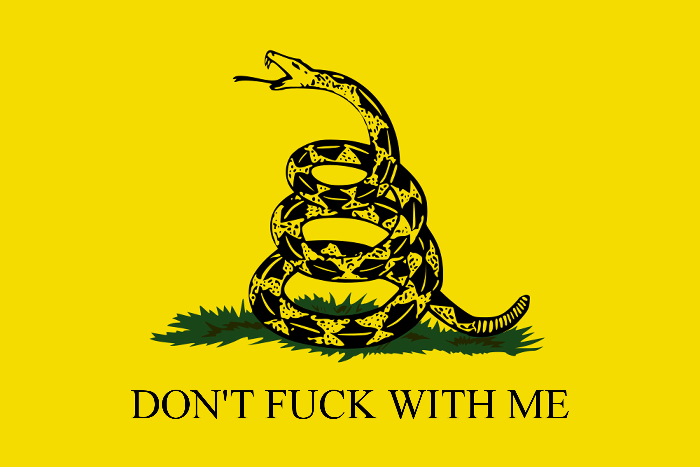

# Don't tread on memes
Don't tread on me(mes)

## Dependencies
- [`click`](http://click.pocoo.org/)
- [`Pillow`](https://python-pillow.org)

## Python interface
This program provides a simple python interface for generating "don't tread on memes."

A single method is exposed, `tread_on` which generates a PIL image of the "Don't Tread on Me" flag with a custom caption. A single parameter, `phrase`, represents the string with which to replace "tread on."

```python
import dont_tread_on_memes
dont_tread_on_memes.tread_on("test text").show()  # Shows a PIL image of the flag captioned with "DON'T TEST TEXT ME"
```

## CLI
After cloning the repository, you can run `python3 -m dont_tread_on_memes` from inside the repository root to use the CLI.

```
Usage: __main__.py [OPTIONS]

  Create a Don't Tread on Meme — an image of the Gadsden flag with the words
  "DONT TREAD ON ME" replaced by something else.

Options:
  --message <caption>     A message to use as a caption for the flag
  --format / --no-format  Whether to format the provided message as 'Don't
                          <caption> me' (default) or to use the provided
                          message as the entire caption.
  --save TEXT             Where to save the image
  --help                  Show this message and exit.
```

If `--message` is omitted, the user will be prompted to provide a message. If `--save` is omitted, the image will be displayed using PIL's `PIL.ImageShow` module.

## Examples
An image generated via the CLI:


